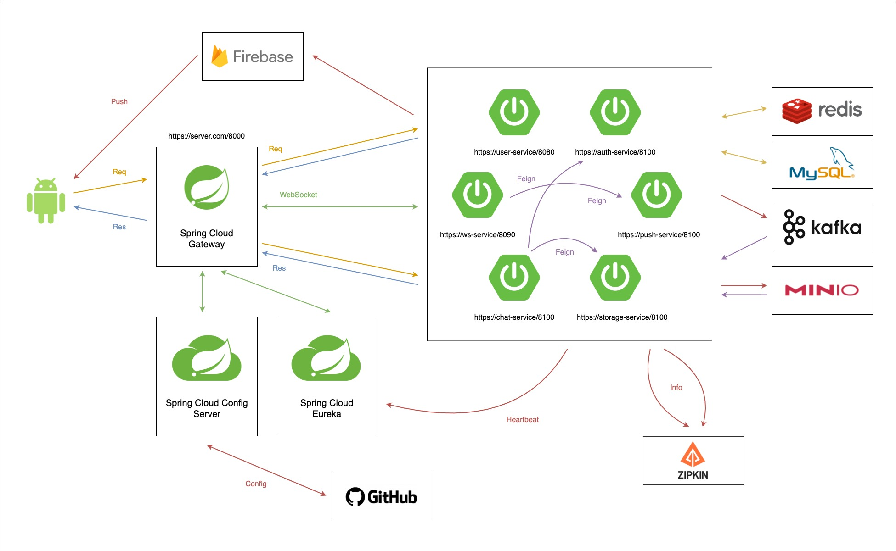
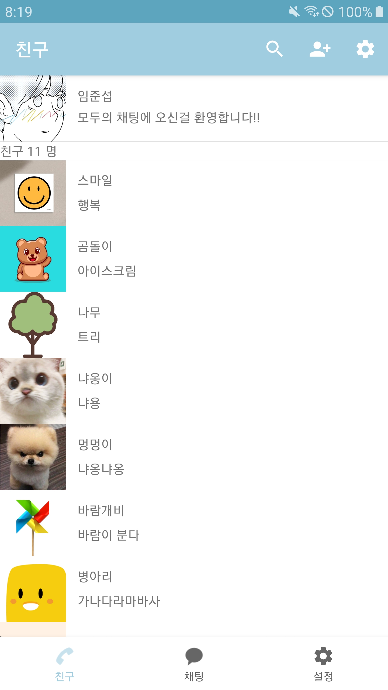
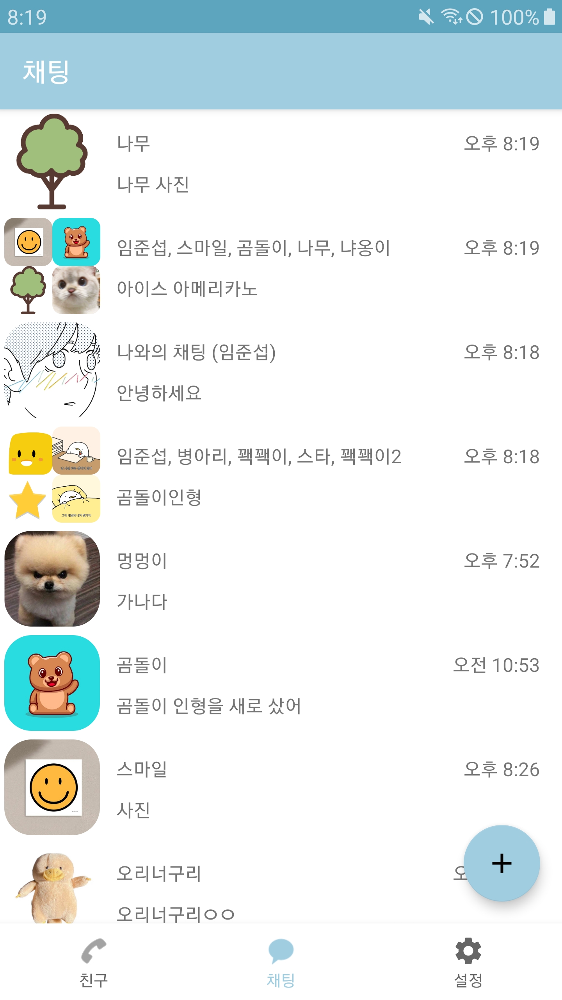
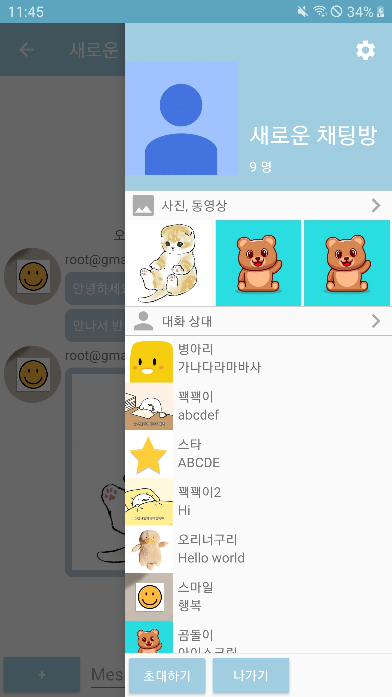

<!-- PROJECT LOGO -->
<br />
<div align="center">
  
  <h3 align="center">Modu-Messenger</h3>

  <p align="center">
    모두의 메신저 프로젝트의 통합 저장소 입니다.<br>
    개발 내용에 관한 내용은 아래의 문서에서 확인 가능합니다.<br>
    <a href="./android/ModuMessenger/README.md"><strong>안드로이드 문서</strong></a><br>
    <a href="./backend/ModuMessenger/README.md"><strong>백엔드 문서</strong></a><br>
  </p>
</div>

---

## 프로젝트 구조


---

## 모두의 채팅 어플리케이션

| 시작 화면 | 친구 리스트 | 채팅방 리스트 |
| :--------: | :--------: | :--------: |
|||  |
| 구글 소셜 로그인 | 친구 프로필 사진, 상태 메세지 표시 | 채팅방 목록 표시<br> 1대1 채팅방, 단체 채팅방 |

| 채팅방 화면 | 채팅방 메뉴 | 프로필 수정 |
| :--------: | :--------: | :--------: |
|||  |
| 채팅중인 친구의 프로필 및 시간 표시 | 채팅방 친구 표시<br>채팅방 설정 및 친구 초대 | 프로필 수정<br>프로필 사진, 이름, 상태메세지 수정 |

| 친구 찾기 |
| :--------: |
||
| 새로운 친구 추가 가능 |

---

## 주요 도메인 모델

### 채팅 관련 도메인 모델 구조


### 도메인 모델 개선

1대다 연관관계 및 1대1 연관관계의 경우 초기 설계 그대로 진행   
다대다 연관관계의 경우 중간에 연관 테이블을 하나 둠으로써 1대다, 1대다로 관계를 풀어나감   
@ManyToMany 의 사용을 지양 (자세한 내용은 백엔드 개발 문서에 채팅방 - 유저에서 확인)   

---

## 브랜치 관리 전략

### 브랜치 종류

깃플로우를 사용하나, release 브랜치는 사용하지 않음  
작업시에 feature/<작업 내용> 으로 feature 브랜치 생성후 작업한뒤  
develop 브랜치에 풀리퀘스트 요청(아래의 커밋 컨벤션대로 작성)  
develop에서 개발이 완료된 기능 단위를 묶어서 master 브랜치로 풀리퀘스트 요청  

`feature` -> `develop` 의 풀리퀘스트 내용에는 커밋 컨벤션을 그대로 따라감  
`develop` -> `master` 의 풀리퀘스트 내용에는 아래와 같이 커밋 첫줄만 모아서 작성함  

`master` 에는 릴리즈가능한 버전 상태를 유지 (feature에서 master로의 풀리퀘스트 금지)  
`develop` 에는 개발중인 상태가 유지될수 있음 (때로는 기능이 제대로 작동하지 않을수 있음)  

master 에 풀리퀘스트 내용 작성 예시

```
Feat: "회원 dto에 프로필 아미지 추가" #21
Feat: "친구 이름에 공백 생기는 문제 수정" #22
Feat: "친구 찾기 실패 오류 메시지 추가" #23
```

---

## 커밋 컨벤션

### 커밋 작성

첫번째줄 - 태그 이름 작성 [Feat|Fix|Mod|Refactor|Docs|Test] 및 간랸한 내용 작성  
두번쨰줄 - 자세한 작업 내용 기록  
세번째줄 - 수정시 해결 버전, 참조 버전, 관련 버전 (버전은 깃허브 풀리퀘스트 넘버링)  

### 커밋 예시

```
Feat: "로그인 관련 api 추가"

회원 로그인 api 추가
  - oauth 기반 로그인 코드 추가
  - 로그인시 패스워드 암호화 처리 로직 추가

Resolves: #321
Ref: #456
Related to: #391, #312
```

---